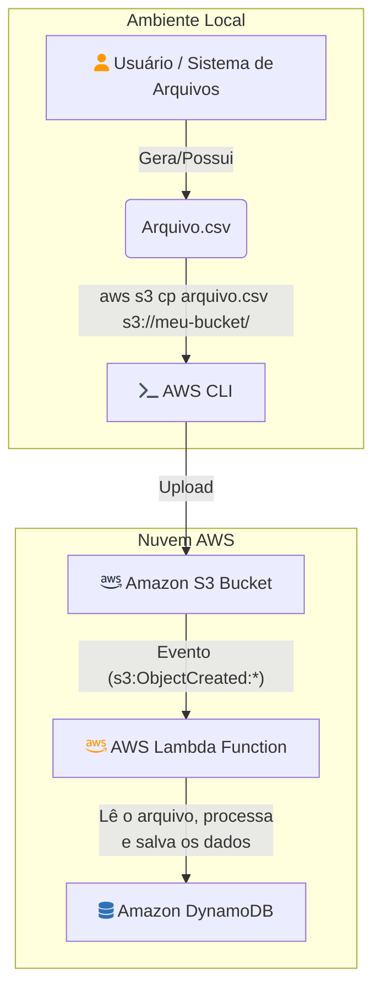
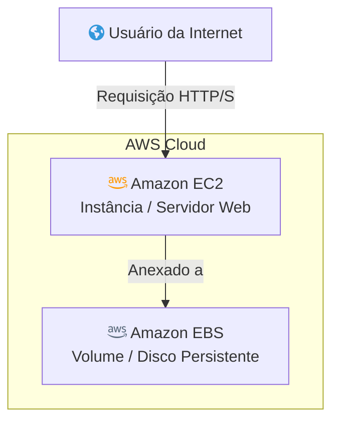

# 🚀 AWSarchitecture

Projeto desenvolvido para o desafio do **Bootcamp Santander Code Girls**.  
O objetivo é demonstrar duas soluções de arquitetura AWS para armazenamento e processamento de dados, utilizando **EBS**, **Lambda Function**, **EC2** e **S3**.

---

## 🌐 Visão Geral

Este projeto apresenta **duas arquiteturas**:

1. 🗂️ **Processamento de arquivos CSV via Lambda e DynamoDB**
2. 🖥️ **Servidor Web em EC2 com armazenamento persistente em EBS**

---

## 1️⃣ Processamento de Arquivos CSV (Lambda + S3 + DynamoDB)

### 🔄 Fluxo Resumido

1. O usuário gera ou possui um arquivo `.csv` localmente.
2. Utiliza o **AWS CLI** para fazer upload do arquivo para um bucket **S3**.
3. O **S3** dispara um evento ao receber o arquivo.
4. Uma **função Lambda** é acionada, lê o arquivo, processa os dados e salva no **DynamoDB**.

### 📊 Diagrama Mermaid

---

## 2️⃣ Servidor Web com EC2 + EBS

### 🔄 Fluxo Resumido

1. Usuários da internet acessam o servidor web hospedado em uma instância **EC2**.
2. O **EC2** está conectado a um volume **EBS**, garantindo armazenamento persistente para dados do servidor.

### 📊 Diagrama Mermaid

---

## 💡 Observações

- Os diagramas foram criados no [draw.io](https://draw.io) e também estão disponíveis em código Mermaid para facilitar visualização em Markdown.
- O projeto demonstra boas práticas de arquitetura AWS, separando processamento **serverless** (Lambda) e infraestrutura tradicional (**EC2 + EBS**).

---

## 👀 Como visualizar os diagramas

Você pode visualizar os diagramas Mermaid diretamente em plataformas que suportam esse formato, como o **GitHub** ou extensões do **VS Code**.

---

## 📚 Referências

- [AWS Lambda](https://docs.aws.amazon.com/lambda/latest/dg/welcome.html)
- [Amazon EC2](https://docs.aws.amazon.com/ec2/)
- [Amazon EBS](https://docs.aws.amazon.com/ebs/)
- [Amazon S3](https://docs.aws.amazon.com/s3/)
- [Amazon DynamoDB](https://docs.aws.amazon.com/dynamodb/)

---
